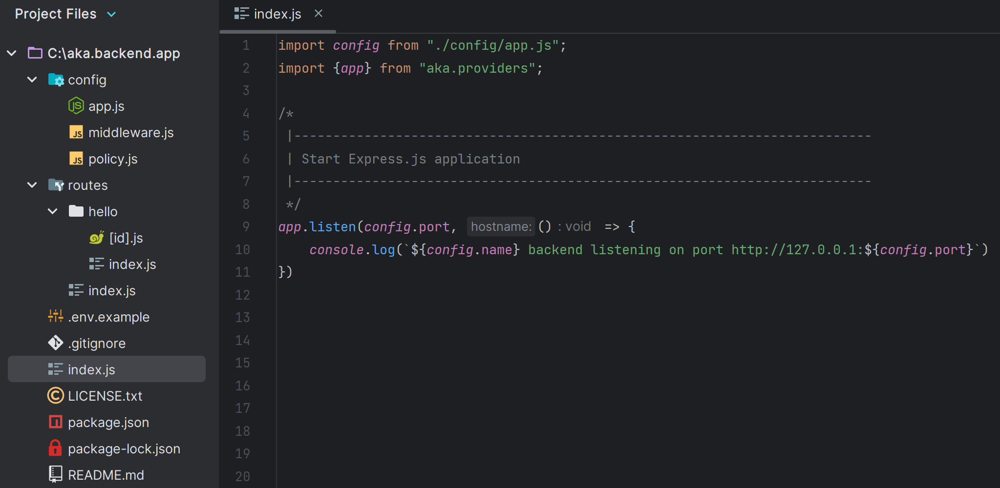

# Project Structure

The default application structure is intended to provide a great starting point for both large and small
applications. But you are free to organize your application however you like.

## The Root Directory

Structure of your project:



## /config

This folder contains all the configuration settings for your application, including database connections, server
settings, and other important options. These configurations are written in ES6 and are exported as an object, making it
easy to access and modify them throughout your code. By keeping your configuration settings in a separate folder, you
can easily manage different environments and deploy your application to various platforms with different configurations.

### /config/app.js

```js
export default {

    /**
     |--------------------------------------------------------------------------
     | Application Name
     |--------------------------------------------------------------------------
     |
     | This value is the name of your application. This value is used when the
     | framework needs to place the application's name in a notification or
     | any other location as required by the application or its packages.
     |
     */

    name: process.env.APP_NAME || 'aka backend',
```

This file contains all the configuration settings for your application, including the name of your application, the port
it runs on, and other settings that you may need to customize. These configurations can be used throughout your
application to ensure consistency and easy maintenance. You can also use this file to initialize any middleware or
libraries that your application needs to function properly. By keeping all the configuration settings in one place, you
can easily manage and maintain your application's behavior and performance.

### /config/policy.js

```js
export default {

    /**
     |--------------------------------------------------------------------------
     | Application origin
     |--------------------------------------------------------------------------
     |
     | This value is the origin of your application. This value is used when the
     | framework needs to place the application's origin in
     | any other location as required by the application or its packages.
     |
     */
    origin: ['http://127.0.0.1:3000'],
```

This file contains the CORS policy for your application, which specifies which origins are allowed to access your
application's resources. It also contains the allowed methods for both CORS and routing.

:::note
If you add or remove a method, such as POST, in this file, your application will no longer accept requests with that
method, even if you have routes that are set up to handle POST requests. This can be useful for enforcing security or
for limiting the methods that are allowed for a particular endpoint._
:::

### /config/session.js

```js
export default {

    /**
     |--------------------------------------------------------------------------
     | Application origin
     |--------------------------------------------------------------------------
     |
     | This value is part of your application. This value is used when the framework
     | needs to place this value in any other location as required
     | by the application or its packages.
     |
     */
    resave: false, // don't save session if unmodified
```

In the file, we have the configuration settings for the session middleware in Express. The
express-session package is used to create a session middleware that persists session data between HTTP requests. This is
done by generating a unique session ID for each user and storing it as a cookie in the user's browser.

The configuration options include:

- secret: a string used to sign the session ID cookie to prevent tampering
- resave: a Boolean value that determines whether to save the session even if it was not modified during the request
- saveUninitialized: a Boolean value that determines whether to create a new session if there is no active session for
  the user
- cookie: an object that defines the session cookie settings, such as the cookie name, expiration time, and secure flag.

These settings can be customized to fit the specific needs of the application, such as setting a longer session timeout
or a more secure cookie.

### /config/use.js

```js
import helmet from "helmet";

export default {

    /**
     |--------------------------------------------------------------------------
     | helmet.js middleware
     |--------------------------------------------------------------------------
     |
     | security middleware for Express.js that helps protect your web application
     | from several common attacks.
     */
    helmet: helmet()
```

This file contains all the middleware functions for ExpressJS, the framework used by aka backend. These middleware
functions are injected into your application in the order they are added to this file. You can add or remove middleware
functions in this file to customize the behavior of your application.

Middleware functions can be used to handle requests and responses, parse data, authenticate users, and perform other
tasks that are necessary for your application
to function properly. By keeping all the middleware functions in one file, you can easily manage and modify your
application's behavior and ensure that it runs smoothly.

## /middlewares

The directory contains all the middleware functions that are loaded before any other middleware in the
application. This means that all default middleware functions exported from the files in this directory will be injected
into Express using the app.use() method, making it easier to manage custom middleware functions.

:::note
It's worth noting that you can create subdirectories within the /middlewares directory to organize your middleware
functions even further.
:::

## /middlewares/index.js

```js
export default (req, res, next) => {
    // console.log(`${req.method} ${req.url}`);
    next();
}
```

In the file there is an example of a global middleware that logs the requests.

:::note
This middleware function uses the express app.use() method to attach itself to every request before they are passed to
other middleware or routes. It logs the HTTP method, the URL, and the remote IP address of the incoming request.
:::

## /public

The folder contains all the files that are served by the server, such as CSS, images, videos, JavaScript, and
other static assets. These files are served using the default middleware provided by Express, which can be configured in
the use.js file located in the config folder.

:::note
By default, the static middleware is used to serve static files.
:::

## /public/social-cards.png

Is an example file that can be found in the URL of the app, such as http://127.0.0.1:3000/social-cards.png. It is a file
that is stored in the public directory and can be accessed by anyone who has the URL of the file.

:::important
However, you need to activate it by removing the comments, just like all the optional middlewares in the use.js file of
the config.
:::

## /routes

This folder contains all the routes that will be loaded at the system level for your application. This folder contains
route files, where each file corresponds to a specific route, and the method chosen for export corresponds to the HTTP
method.

:::note
The index files are the base for the routes. For example, if you have a file named users/index.js, it will become the
base route "/users". If you export a "GET" function in the users/index.js file, you can make a GET request to "/users"
and retrieve the desired data.
:::

### routes/index.js

```js
/**
 *
 * @param req
 * @param res
 */
export default function get(req, res) {
    res.json({
        method: 'GET',
        message: 'Start from editing routes/index.js',
    })
}
```

This file contains the first route for your application, which is the root route ("/"). This file exports a constant
named "get", which is a function that takes the parameters "req", "res", and "next" (optional) and handles the incoming
HTTP GET request.

:::note
This file is an example of how to define a route in aka backend framework. By exporting a function that takes the
necessary parameters, you can define your routes and handle incoming requests. You can modify this file to include
additional routes or to modify the behavior of the root route.
:::

## /routes/hello

This folder contains an index.js file, which is the default file that the system responds to. If there is a file named
hello.js in this folder, the code inside the index.js file will still be executed instead of the code inside the
hello.js file. When you access the "/hello" route in your application, the system will look for an index.js file in the
/routes/hello folder and execute the code inside that file. By naming your file index.js, you can ensure that the system
responds to the correct file and executes the intended code.

:::note
By organizing your routes into separate folders like "/routes/hello", you can easily manage and maintain the behavior of
your application's routes. This makes it easy to add new routes, modify existing ones, or remove routes that are no
longer needed, all while maintaining a clear and organized structure for your application.
:::

### routes/hello/[id].js

```js
/**
 *
 * @param req
 * @param res
 */
export default function all(req, res) {

    const {id} = req.params; // get query params

    res.json({
        method: req.method,
        params: id,
        message: 'Start from editing routes/hello/[id].js',
    })
}
```

This file corresponds to a dynamic route, which means that it contains parameters that can be passed in as part of the
route. In this case, the parameter is "id", which is enclosed in square brackets to distinguish it from the rest of the
route.

:::info
For example, if you have a file named "hello/[id].js" in this folder, and you make a GET,POST,PATCH,DELETE request to "
/hello/params", the
system will capture "params" as the value of the "id" parameter and execute the code inside the file with the
appropriate parameter value.

:::

### routes/hello/index.js

```js
/**
 *
 * @param req
 * @param res
 */
export default function post(req, res) {

    const {...data} = req.body; // get post params

    res.json({
        method: 'POST',
        data: data,
        message: 'Start from editing routes/hello/index.js',
    })
}
```

This file contains an example of a POST route, which demonstrates how to handle POST requests and process parameters
passed in the request body, instead of as query parameters.

:::tip
In this file, you can see how to define a route that accepts a POST request and how to access the data passed in the
request body. By using the appropriate middleware and methods, you can parse the request body and extract the necessary
data to perform the intended operations.
:::

## /.env

This file contains environment variables that are specific to your project, such as API keys, database credentials, and
other sensitive information. These variables are loaded into your application at runtime and can be accessed through the
process.env object in your code. It's important to keep this file secure and not to commit it to your version control
system.

## /.env.example

This file is a template for your .env file and provides an example of the environment variables that your application
requires. This file is typically committed to your version control system so that other developers can see what
environment variables are needed for the project.

## /LICENSE.txt

This file contains the license for your project, which specifies the terms and conditions under which others can use,
modify, and distribute your project. There are many different types of licenses, each with its own set of rules and
restrictions, so it's important to choose a license that suits your needs and goals for the project. Including a license
in your project helps ensure that others can use and contribute to your project with clarity and transparency.

## /README.md

This file contains documentation for your project. Here you can provide information on how to install, use, and
contribute to your project, as well as provide instructions for deployment and other important information for users.

## /package-lock.json

This file is automatically generated when you install dependencies for your project through npm. It contains an exact
copy of the dependencies and versions used for your project, ensuring consistency across team members and across
different development environments.

## /package.json

This file contains information about your project, such as the package name, version, dependencies, build and test
scripts, and other useful information for running your project. You can also use this file to configure other settings,
such as project description, author, and license.

## /.gitignore

This file specifies the files and folders that should not be tracked by the Git version control system. Typically, this
file is used to exclude temporary files, log files, local configuration files, and other resources that are not strictly
necessary for the operation of the project and that may change frequently during development. This way, you can keep
your Git repository clean and organized.

## /index.js

```js
import {app} from "aka.providers"; // must init before all
import config from "./config/app.js";

/*
 |--------------------------------------------------------------------------
 | Start Express.js application
 |--------------------------------------------------------------------------
 */
app.listen(config.port, () => {
    console.log(`${config.name} backend listening on port http://127.0.0.1:${config.port}`)
})
```

In the index.js file of your Aka backend project, you can find the code for starting the server. One important thing to
note is that if you are using the aka.provider package to manage environment variables, you need to import it before any
other package that may use those variables. This is to ensure that the environment variables are properly loaded before
they are accessed by other packages.

:::warning
Additionally, [aka.provider] package uses the dotenv package to load environment variables from a .env file in your
project's root directory. This file should not be committed to version control to prevent leaking sensitive information.
Instead, you should provide a .env.example file that contains sample environment variable values for other developers to
reference.
:::